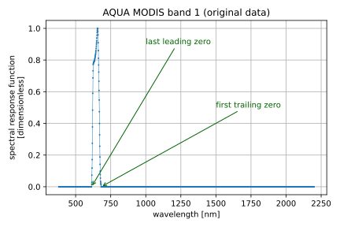
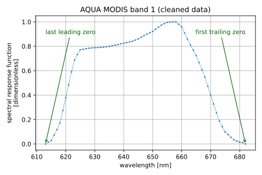
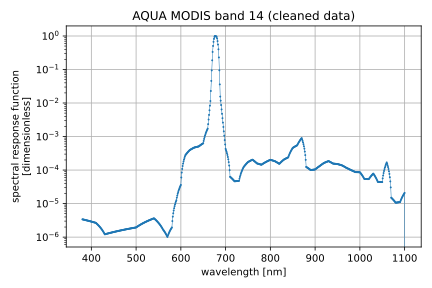
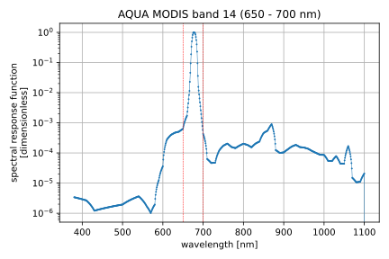
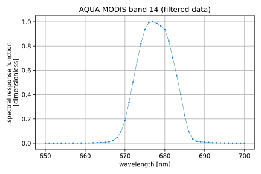
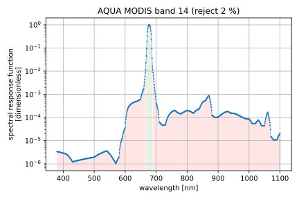
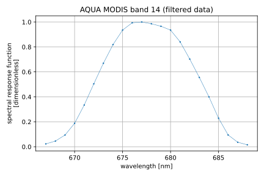

# Spectral response function data sets

## Structure

Spectral response function data sets are stored as NetCDF data sets, whose
structure is the following:

**Coordinates (\* means also dimension)**

* `*w` (float): wavelength `[length]`

**Variables**

* `srf [w]` (float): spectral response function `[dimensionless]`
* `srf_u [w]` (float): spectral response function uncertainty `[dimensionless]`

**Metadata**

* `platform` (str): platform name, e.g. `"Sentinel-2A"`
* `instrument` (str): instrument name, e.g. `"SLSTR"`
* `band` (str): band identifier, e.g. `"1"`

As per the [CF Conventions](https://cfconventions.org/), if possible and/or
relevant, the following data set attributes should be provided:

* `title` (str)
* `institution` (str)
* `source` (str)
* `history` (str)
* `reference` (str)
* `comment` (str)

and the attribute `Conventions` should be set to `"CF-1.9"`.
## Remarks

Original spectral response function data as downloaded from the website of the
data provider (e.g. https://oceancolor.gsfc.nasa.gov/docs/rsr for the MODIS 
instrument onboard the AQUA platform, last visited on 2022-05-02) often contain
non-relevant data points, as illustrated below for the spectral response
function of MODIS's band 1 (downloaded on 2022-05-02 from 
https://oceancolor.gsfc.nasa.gov/docs/rsr/aqua_modis_RSR.nc).

The figure shows the presence of a large number of data points where 
the spectral response function is zero.
These leading and trailing zeros, except the last leading zero and first
trailing zero, are irrelevant.
The spectral response function data sets shipped with Eradiate have been
cleaned so that all leading zeros except the last one and all trailing zeros
except the first one, when present, are dropped, as illustrated below for the 
spectral response function of MODIS's band 1.

Some spectral reponse function spectra extend over a relatively
large spectral range (even cleaned), as illustrated below with the spectral 
response function of MODIS's band 14.

The spectral interval covered, [380, 1101] nm, is much larger (by a factor of
72) than the [673, 683] nm interval indicated by the MODIS instrument
specifications at
https://modis.gsfc.nasa.gov/about/specifications.php
(last visited on 2022-06-14).
Arguably, the instrument is barely responsive (spectral response function is
less than 1%) in the range outside [660, 690] nm.
However, Eradiate being oriented towards delivering high-accuracy results, it
works with the whole spectral response function spectrum, whatever the width of
the spectral range.
In the case of AQUA MODIS 14, that means that Eradiate will approximately run
72 times as many simulations as it would if the spectral reponse function
covered only the wavelength range [673, 683] nm.

This is why Eradiate provides the user with a set of filters that can be used 
to create a spectrally narrower spectral reponse function data set and
**find a better simulation speed versus accuracy tradeoff**.
It must be stressed that using filtered spectral response function data sets
will inevitably lead to less accurate results.
As a result, choosing and configuring the filters must be done with great care.
The filter choice and configuration is the entire reponsibility of the user.

### Spectral filter

This filter discards all data points that fall out of a specified wavelength 
range.

The action of this filter is illustrated by the figures below with AQUA MODIS 
band 14 when the filter is used with a [650, 700] nm wavelength range
(represented with dashed lines in red).

### Integral filter

This filter computes the integrated spectral response function value and reject
all data points, from the extreme left and right ends of the spectral range, 
that contribute to less than a specified percentage of this value.

The action of this filter is illustrated by the figures below with AQUA MODIS 
band 14 when the filter is used with a 2 % rejection percentage (represented
by the region filled in red).

