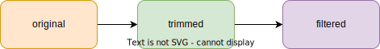

# Spectral response function data sets

This directory collects spectral response function data sets.

Several versions of the spectral response function spectra are collected here.
The scheme below illustrates the relationships between these different versions.

<p align="center">
  
</p>

The original spectral response function data set refers to the spectral response data set as it is downloaded from the data provider (e.g., space agency website).
Often, irrelevant data points are included in this original data (leading and trailing zeros) and can be trimmed.
Even trimmed, some spectral response function data still extend on a relative wide spectral range compared to the spectral region where the response is significant (i.e., of the order of magnitude close to 1.0).
In such a case, a filter can be applied so that only a "significant" part of the response function spectrum is kept.


## `trimmed/`

Data sets under this sub-directory have been trimmed from leading zeros (except 
last one) and trailing zeros (except first one).

---

This trimming operation **does not lose any information** but instead 
discard all irrelevant data points from the original data sets.
As a result, it is the recommended default version of the spectral response function data set.

---

The plots below illustrate the difference between the original data (left) and trimmed data (right).


## `99/`

This sub-directory contains filtered versions of the data sets in `trimmed/`.
The filter selects a region that contains 99 % of the integrated spectral response function (green area in below plots) by excluding 0.5 % of this value from the left and 0.5 % from the right (red areas in below plots).

---

This filtering operation **effectively looses information** but the corresponding
filtered data sets may represent a better simulation speed-accuracy tradeoff for applications where working with a narrower spectral interval (e.g., 
approximately 4 times narrower in below example) is worth discarding data points accounting to 1% of the integrated spectral response function.

---

The plots below illustrate the difference between the trimmed data (left) and filtered data (right).


## `filter.py`

This is a command-line interface to filter original spectral response function data sets.

How to use:

```shell
python filter.py --help
```

For examples of use, see this pull request:
https://github.com/eradiate/eradiate-data/pull/9.